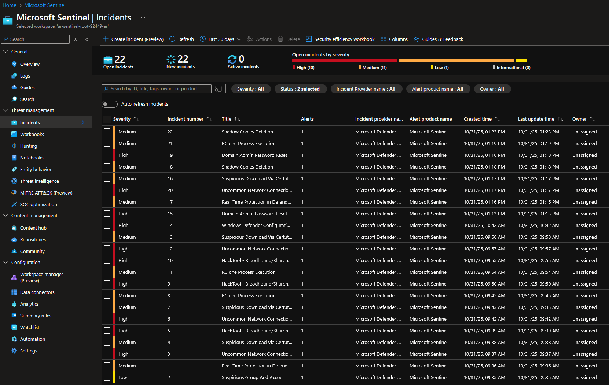
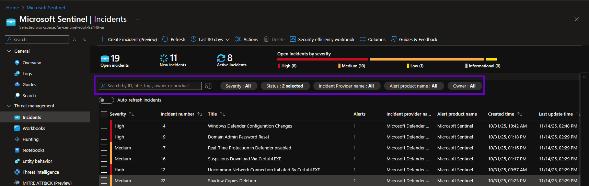
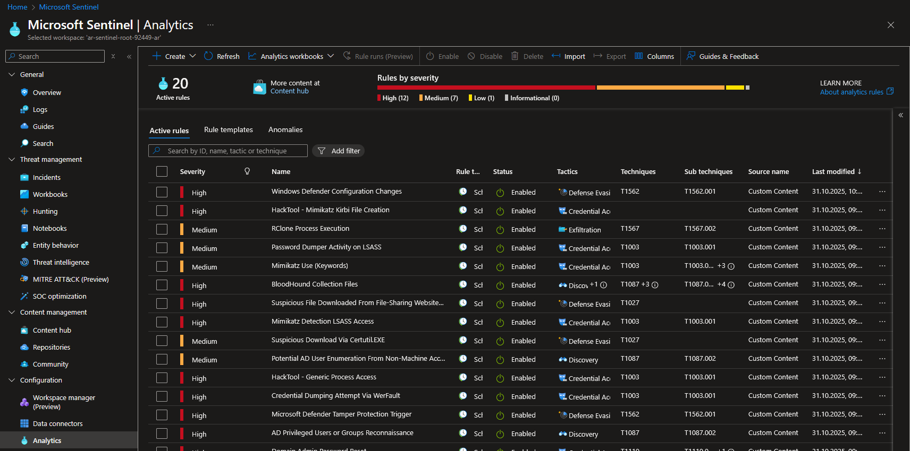
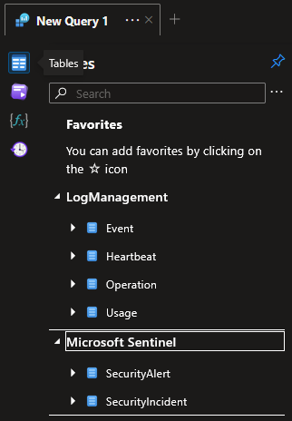
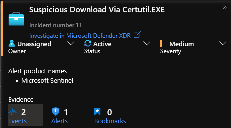
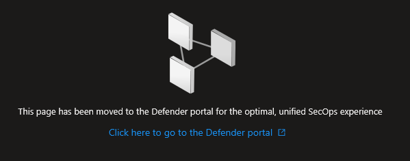

# Verification of Detections and Preventions

In our workshop we're focusing on the detection side since our preventive posture is very "lean". In regular purple team
exercises you will also have much more findings on preventive controls and also much more interaction between preventive
controls and emulation actions during planning as well as execution.

But you may still come across some general findings on preventions. So please take a note of them while you go through the exercise
so we can discuss them at the end of this workshop section.

As for high-level preventive findings you'll probably also have such observations regarding the detective controls. Please make
sure you record them as well for the discussion.

## Introduction and Preparation
- Open the necesssary reference material
  - Open the [detection reference](resources/detection-reference.md)
  - Open the [emulation reference](resources/emulation-reference.md)
- Prepare the documentation for the verification
  - Navigate to your table's subdirectory on [Google Drive](https://drive.google.com/drive/folders/1vgt2CnNr_iRbZpUD5jNu2JX2WpRNgITr?usp=sharing)
  - Open the detection verfication document we prepared for you
  - This will be the place to track and document your verification as well as record any high-level findings you may have

### Sentinel Preparation and Hints
- First, a little refresher on Microsoft Sentinel :snowflake: :snowflake: :snowflake:
- To do the verification in the Sentinel UI
  - Log in to the [Azure Portal](https://portal.azure.com) with your workshop user accounts
  - Use `Search resources, services, and docs` at the top of the screen to search for Microsoft Sentinel
  - Choose the available log analytics workspace (name format `ar-sentinel-root-XXXXX-ar`)
  - Navigate to `Incidents`

- To keep navigation consistent, we recommend using the built-in controls to close sidebars (<< symbol) and opened windows (x symbol). The `Back` button in browsers only works partially
- To distinguish new from previous incidents, you can assign the reviewed ones the status `Closed` and add a comment with the format `Part...` to map them to the corresponding part of the emulation
  - In the `Incidents` view, click any incidents, opening a side panel showing the incident details
  - Click on the `Status` field at the top of the side panel and choose `Closed` as the new stats
  - Press `Apply` to close the incident
  - By default, Sentinel filters out incidents with status `Closed` which can be changed using the `Status` filter on top of the incidents table

- An alternative way is to explicitly set a time frame
  - Click on the drop-down menu labeled with the chosen time frame, by default `Last 24 hours`
  - Specify th relative or absolute time frame by either choosing a preset time frame or entering a custom one
- Get a list of all relevant Splunk detections
  - Navigate to `Analytics` in the left sidebar
  - All configured analytics rules will appear in the list and can be filtered using the filter in the top section

- Open an analytics rule from the incident table in `Incidents`
  - Click the incident you are interested in
  - In the sidebar which opens the incident details, look for the `Analytics rule` sub-title and click the link to the analytics rule
  - Once the `Analytics rule wizard` opens, navigate to the second tab `Set rule logic` to find the KQL query under `Rule query`
- Perform a manual search
  - Navigate to `Logs` in the left sidebar
  - Close the `Queries hub` which opens by default and set the query mode to `KQL mode` using the dropdown in the top right showing `Simple mode` by default
  - Use existing analytics rules for hint concerning the available log sources and syntax. Alternatively, click the `Tables` symbol on the left side to show all available tables in Sentinel

  - Set the desired time frame by clicking the drop-down menu labeled `Time range: Last 24 hours`
  - Enter a search expression, for example `Event | take 10` to get the latest ten log entries in the Event table
  - Hint: As a good practice you should always narrow the amount of data you want to search, for our workshop work with narrow time ranges and always start by limiting the number of returned results by either using the `Show: 1000 results` drop-down or by adding `| take 10` at the end of your query
  - Hint: If you want to understand why a detection did not match it may be helpful to make the corresponding search expression more generic to find out if there is any of the expected data present
- If you have multiple detections or multiple emulation steps with the same technique in the `Incidents` table
  - Check the name of the incident for hints as well as the triggered analytics rule
  - Open the specific incident in the sidebar and click the link to `Events` under `Evidence`
  - This will take you to the original log entries which triggered the analytics rule
  - Open the individual log entries to check the `CommandLine` field identifying what exactly was executed on the command line

  
- If you ever come across the following screen, hit F5 to refresh the page:

### Incidents from the Emulation

In case your emulation did not go well you can consult the PDFs below but you will not be able to drill down into the details of the detection match.

- After emulation part 1 you should have these new [incidents](resources/Incident_Review_Part_1_Sentinel.pdf)
- After emulation part 2 you should have these new [incidents](resources/Incident_Review_Part_2_Sentinel.pdf)

## Procedure for Analysing Emulation

To conduct the verification look at the emulation flow and try to match each step performed to a Sentinel incidents. Write down all your observations in the Google document we prepared for you.

**Note**: Don't get confused if the sequence of the Sentinel detections/incidents is not 100% aligned with the emulation, Sentinel is configured to run all analytics rules in batches every 5'

To perform this task go through each emulation step chronologically and do the following:

- Check if you find a incident that matches the time and action performed in the emulation
  - If so, write down the incident and analytics rule that triggered and
    - Which ATT&CK technique ID does the incident list, note the ones that do not match with the ones listed in the emulation (this is important to make the ATT&CK gap analysis)
  - If not, perform an open log search for a/some good identifying string/s (e.g. quser) of the emulation step
    - If you get no search results - no luck :sob: to fix this you need to collect additional data or even add/improve tooling to monitor it
    - If you get search results
        - check if we have a detection that did not get triggered and take a note
            - Search for a significant term e.g. quser.exe in the Sentinel `Analytics` rules
            - Test the detection by copying the rule query into the manual search in `Logs`
        - if we have no failed detection note down what could be used in the data we collected in Sentinel
- Bonus
    - Check if you can find a detection for an undetected step in the [SigmaHQ repo](https://github.com/SigmaHQ/sigma)
    - Check if you can find out why the detection in place did not trigger
        - Check the syntax of the detection and compare it to the data

### Possible Findings of this Verification

- Technique without a detection
- Technique with a detection that did not trigger (incorrect analytics rule, required data not created/forwarded/indexed correctly)
- Misalignment of detection and emulation technique selection
- Detection which did not detect all executed procedures or other detection quality issues

### Possible Analysis Results :rotating_light: Spoiler Alert! :rotating_light:

- After analysing you could have these [findings](resources/Detection_Verification_Completed.pdf)

## Analysis Summary
- Detections that are [configured vs. that triggered](resources/cti/purple/configured_vs_triggered.json)
- Detections that [triggered and are used by Black Basta](resources/cti/purple/black_basta_detection_coverage.json)

..or open them directly in [Navigator](https://mitre-attack.github.io/attack-navigator/#layerURL=https%3A%2F%2Fraw.githubusercontent.com%2Ftscomm99%2Fpurple-team-workshop-2025-01%2Frefs%2Fheads%2Fmain%2Fresources%2Fcti%2Fpurple%2Fconfigured_vs_triggered.json&layerURL=https%3A%2F%2Fraw.githubusercontent.com%2Ftscomm99%2Fpurple-team-workshop-2025-01%2Frefs%2Fheads%2Fmain%2Fresources%2Fcti%2Fpurple%2Fblack_basta_detection_coverage.json)

## More Ways to Leverage ATT&CK

### Preventive Posture
- MITRE Engenuity Evaluations https://attackevals.mitre-engenuity.org
- D3FEND https://d3fend.mitre.org
- ATT&CK Mitigations https://attack.mitre.org/mitigations/enterprise/
- Mappings Explorer https://center-for-threat-informed-defense.github.io/mappings-explorer/

### Detection Posture
- MITRE CAR https://car.mitre.org
- ATT&CK DataSources https://attack.mitre.org/datasources/
- Top Techniques https://top-attack-techniques.mitre-engenuity.org/
